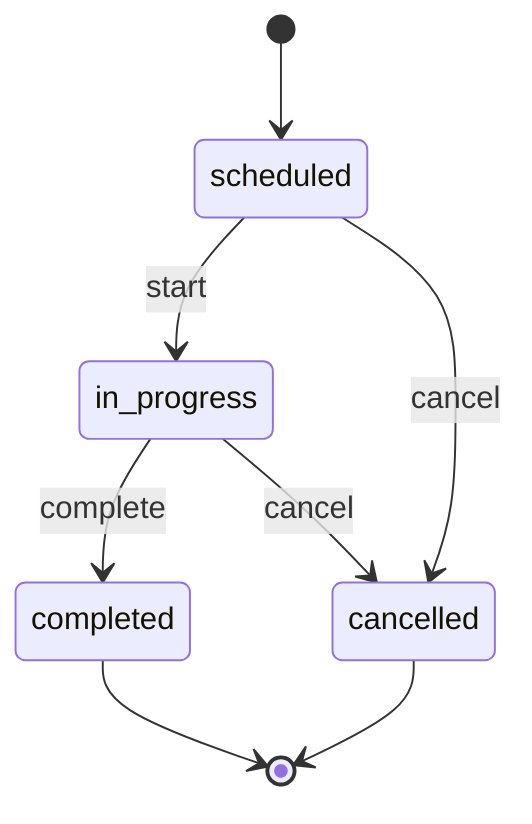

# Day 309 📐

**P-309** · 📐 **UML that earns its keep** — ⭐⭐ and the state diagram nobody draws

**Time:** 3 hrs · **Mode:** LEARN + BUILD

> ⭐⭐ **The sentence to own: a diagram is a communication tool with an audience and a decision
> attached — so if you cannot say who reads it and what they do differently afterwards, you are
> drawing notation, and nobody has ever been hired for correct arrowheads.**
>
> ⭐ Three diagram types are worth your time. ⭐⭐ The most valuable of them is the one almost nobody
> draws, and it is the one that maps directly onto code you already wrote.

---

# Part 1 — ⭐⭐ The test every diagram must pass

```
⭐⭐ TWO QUESTIONS, BEFORE YOU DRAW ANYTHING:
⭐   ① ⭐ WHO READS THIS?
⭐   ② ⭐⭐ WHAT DO THEY DO DIFFERENTLY BECAUSE OF IT?
⭐   ⇒ ⭐ If ② has no answer, ⭐⭐ THE DIAGRAM IS DECORATION —
⭐     and decoration has a real cost, because it goes stale and
⭐     then actively misleads.

⭐⭐ THE THREE THAT USUALLY PASS:
⭐   ⭐ CLASS — "what are the pieces and how do they relate?"
⭐   ⭐ SEQUENCE — ⭐⭐ "IN WHAT ORDER, AND WHO WAITS?"
⭐   ⭐ STATE — ⭐⭐ "WHAT IS LEGAL, AND WHAT IS NOT?"

⭐ THE ONES THAT USUALLY DON'T, unless specifically requested:
⭐   ⭐ activity · component · deployment · use case · object
⭐   ⇒ ⭐ Not because they are bad, but because ⭐⭐ THEY
⭐     ANSWER QUESTIONS NOBODY IN THE ROOM IS ASKING, and every
⭐     minute drawing one is a minute not spent on the race
⭐     condition (Day 308).

⭐⭐ AND THE THING NOBODY IS GRADING: ⭐ filled vs hollow
⭐   diamonds, arrowhead styles, whether it is technically
⭐   aggregation or composition. ⭐⭐ IF YOU SPEND TEN SECONDS
⭐   DECIDING BETWEEN THOSE TWO DIAMONDS, YOU HAVE SPENT TEN
⭐   SECONDS ON THE ONE THING WITH NO INFORMATION IN IT.
```

---

# Part 2 — ⭐⭐ The class diagram: multiplicity carries the meaning

```
⭐   ⭐ Order ──1───*── OrderLine
⭐   ⭐ Order ──*───1── Customer
⭐   ⭐ Assignment ──*───1── Technician

⭐⭐ THE INFORMATION IS IN THE ***NUMBERS AND THE DIRECTION***,
⭐   NOT IN THE BOXES.
⭐   ⭐ `Order 1 → * OrderLine` tells a reader: lines belong to
⭐     one order, ⭐⭐ SO THE ORDER IS THE AGGREGATE ROOT AND
⭐     THE LINE HAS NO INDEPENDENT LIFE (Day 305).
⭐   ⭐ A box labelled `Order` with a list of fields tells them
⭐     ⭐⭐ ALMOST NOTHING THEY COULD NOT GET FROM THE FILE.

⭐⭐ WHAT TO INCLUDE — AND THE CONSTRAINT IS THE POINT:
⭐   ⭐ 6–8 classes maximum. ⭐⭐ MORE THAN THAT AND NOBODY
⭐     READS IT, INCLUDING YOU IN TWO MONTHS.
⭐   ⭐ Relationships with multiplicity and direction.
⭐   ⭐ Only the 2–3 attributes that ⭐⭐ CARRY THE DESIGN —
⭐     `status`, `tenant_id`, the amount. ⭐ Not `created_at`.
⭐   ⭐ Only the methods that ⭐⭐ EXPRESS BEHAVIOUR — `complete()`,
⭐     `allocate()`. ⭐ Never getters, never `__init__`.

⭐ ⭐ AND MARK THE AGGREGATE BOUNDARY — draw a box around it.
⭐   ⭐⭐ THAT ONE ANNOTATION CARRIES MORE INFORMATION THAN
⭐   EVERY ATTRIBUTE ON THE PAGE, because it tells the reader
⭐   what is loaded together, locked together and committed
⭐   together.
```

---

# Part 3 — ⭐⭐ The sequence diagram: draw the interesting flow

```
⭐   Client   API      Service   Repo   Payments   Outbox
⭐     │  POST  │         │       │        │         │
⭐     ├───────►│ complete│       │        │         │
⭐     │        ├────────►│ get   │        │         │
⭐     │        │         ├──────►│        │         │
⭐     │        │         │◄──────┤        │         │
⭐     │        │         ├────────────────────────►│ add
⭐     │        │         │ commit│        │         │
⭐     │        │◄────────┤       │        │         │
⭐     │◄───────┤ 200     │       │        │         │
⭐     │        │         │       │  ⭐⭐ relay, LATER, separate txn
```

```
⭐⭐ WHY THIS IS THE MOST USEFUL DIAGRAM IN PRACTICE: IT
⭐   EXPOSES THINGS A CLASS DIAGRAM STRUCTURALLY CANNOT.
⭐   ⭐ ⭐⭐ ORDER — what happens before what
⭐   ⭐ ⭐⭐ SYNCHRONICITY — who waits for whom
⭐   ⭐ ⭐⭐ THE TRANSACTION BOUNDARY — draw it as a box, and
⭐        ⭐ any external call inside that box is Day 256's rule
⭐        being violated, ***VISIBLY***, to everyone in the room
⭐   ⭐ WHERE FAILURE IS POSSIBLE

⭐⭐ AND THE RULE: ***DRAW THE FLOW WITH THE FAILURE IN IT,
⭐   NOT THE HAPPY PATH.***
⭐   ⭐ The happy path is obvious and nobody disagrees about it.
⭐   ⭐⭐ THE PROVIDER TIMING OUT (Day 263) IS THE FLOW WHERE
⭐     THE DESIGN IS ACTUALLY DECIDED, and drawing it forces
⭐     the `payment_unknown` conversation to happen at design
⭐     time instead of in production.
⭐   ⇒ ⭐ In an interview, ⭐⭐ DRAWING THE FAILURE SEQUENCE
⭐     UNPROMPTED IS ONE OF THE STRONGEST SIGNALS AVAILABLE.
```

---

# Part 4 — ⭐⭐ The state diagram nobody draws

```
⭐            ┌──────────┐
⭐            │ scheduled│
⭐            └────┬─────┘
⭐        start    │      cancel
⭐        ┌────────┴────────┐
⭐        ▼                 ▼
⭐  ┌──────────┐      ┌──────────┐
⭐  │in_progress│      │ cancelled│  ⭐⭐ TERMINAL
⭐  └────┬─────┘      └──────────┘
⭐       │ complete
⭐       ▼
⭐  ┌──────────┐
⭐  │ completed│  ⭐⭐ TERMINAL
⭐  └──────────┘
```

```
⭐⭐ WHY THIS IS THE MOST VALUABLE OF THE THREE, AND THE LEAST
⭐   DRAWN:

⭐ ① ⭐⭐ IT MAKES ***ILLEGAL*** TRANSITIONS VISIBLE. ⭐ A
⭐     class diagram shows `status: str` and says nothing. ⭐⭐
⭐     THIS SHOWS THAT `cancelled → in_progress` DOES NOT EXIST,
⭐     WHICH IS A RULE, NOT A DRAWING.

⭐ ② ⭐⭐ IT FORCES THE QUESTION FOR ***EVERY CELL***: what
⭐     happens on `cancel` while `in_progress`? ⭐ Draw the
⭐     grid of states × events and ⭐⭐ EVERY EMPTY CELL IS A
⭐     DECISION NOBODY HAS MADE — ⭐ and in production, an
⭐     undecided cell becomes whatever the code happens to do.

⭐ ③ ⭐⭐ IT MAPS DIRECTLY TO CODE YOU HAVE ALREADY WRITTEN
⭐     (Day 254): the transition table as data, and one
⭐     `can_transition()` check. ⭐ The diagram and the
⭐     implementation are the same artefact in two notations,
⭐     which is why this one does not go stale — ⭐⭐ YOU CAN
⭐     GENERATE IT FROM THE TABLE.

⭐ ④ ⭐ IT ANSWERS THE INTERVIEW QUESTION "WHAT IF THEY CANCEL
⭐     WHILE IT'S RUNNING?" ⭐ before it is asked.

⭐ ⇒ ⭐⭐ AND THE ONE ANNOTATION PEOPLE MISS: ***MARK THE
⭐   TERMINAL STATES.*** ⭐ A state with no outgoing arrows is a
⭐   promise that nothing further happens — ⭐⭐ WHICH IS
⭐   EXACTLY THE PROMISE A "REOPEN" FEATURE WILL BREAK IN SIX
⭐   MONTHS, AND YOU WANT THAT CONVERSATION NOW.
```

---

# Part 5 — ⭐ On a whiteboard, under time pressure

```
⭐   ⭐ DRAW: ⭐ boxes with multiplicity · one sequence for the
⭐        interesting flow · the state machine if there is one
⭐   ⭐ SKIP: ⭐ perfect syntax · every attribute · anything
⭐        requiring a legend
⭐   ⭐⭐ AND NARRATE WHILE DRAWING (Day 308) — ⭐ the diagram
⭐        is a prop for the explanation, not a deliverable. ⭐⭐
⭐        A DIAGRAM DRAWN IN SILENCE COMMUNICATES ALMOST
⭐        NOTHING, BECAUSE THE INTERESTING PART IS WHY THE ARROW
⭐        POINTS THAT WAY.
⭐   ⭐ LEAVE SPACE — ⭐⭐ YOU WILL ADD A CLASS. Starting in the
⭐        middle of the board with no room is a small, real,
⭐        entirely avoidable stress.
⭐   ⭐ If you draw the wrong thing, ⭐ cross it out and say why
⭐        (Day 308's recovery move) rather than erasing quietly.
```

---

# Part 6 — ⭐⭐ Diagrams as code



```
⭐⭐ THE HONEST REASON, AND IT IS NOT AESTHETICS:
⭐   ***A DIAGRAM THAT IS NOT IN VERSION CONTROL IS WRONG
⭐      WITHIN TWO MONTHS*** — ⭐ and a wrong diagram is worse
⭐   than no diagram, because someone will trust it.
⭐   ⭐ Mermaid or PlantUML in the repo ⇒ ⭐⭐ IT APPEARS IN
⭐     THE PULL REQUEST DIFF, so changing the state machine and
⭐     not the diagram is visible to a reviewer.
⭐   ⭐ Mermaid renders natively in GitHub and in Markdown, so
⭐     there is no build step to rot.
⭐   ⭐⭐ AND THE STRONGEST VERSION: ***GENERATE THE STATE
⭐     DIAGRAM FROM THE TRANSITION TABLE*** (Day 254). ⭐ Then
⭐     it cannot disagree with the code, because it ***is*** the
⭐     code — ⭐⭐ WHICH IS THE ONLY DOCUMENTATION STRATEGY THAT
⭐     HAS EVER WORKED.
⭐   ⭐ A screenshot of a whiteboard is fine for a conversation
⭐     and worthless as documentation.
```

---

# Part 7 — ⭐ Which diagram answers which question

```
⭐   ⭐ "What are the pieces?"            ⇒ class
⭐   ⭐ "Who owns what?"                  ⇒ class + aggregate box
⭐   ⭐ "What happens when X?"            ⇒ ⭐⭐ SEQUENCE
⭐   ⭐ "Where's the transaction?"        ⇒ ⭐⭐ SEQUENCE
⭐   ⭐ "What if it fails halfway?"       ⇒ ⭐⭐ SEQUENCE
⭐   ⭐ "Can it go from A to B?"          ⇒ ⭐⭐ STATE
⭐   ⭐ "What happens on cancel?"         ⇒ ⭐⭐ STATE
⭐   ⭐ "How is it deployed?"             ⇒ ⭐ a boxes-and-lines
⭐        sketch, ⭐ and nobody needs UML deployment notation
⭐   ⭐ "What does the data look like?"   ⇒ ⭐⭐ AN ERD, WHICH
⭐        IS NOT UML AND IS MORE USEFUL THAN MOST OF UML

⭐ ⇒ ⭐⭐ PICK THE DIAGRAM FROM THE QUESTION, NEVER THE
⭐   QUESTION FROM THE DIAGRAM. ⭐ Drawing all three because a
⭐   book listed three is the same error as building a plugin
⭐   architecture for a parking lot (Day 308).
```

---

## Common mistakes

| Mistake | Correction |
|---|---|
| Drawing without an audience or a decision | It's decoration, and decoration goes stale and misleads. |
| Agonising over diamond and arrowhead types | The one part of the notation with no information in it. |
| A class diagram with twenty boxes | Nobody reads it, including you in two months. |
| Listing every attribute and getter | Include the 2–3 that carry the design and the methods that express behaviour. |
| Omitting multiplicity | The numbers and directions are where the meaning lives. |
| Not marking the aggregate boundary | One annotation worth more than every attribute on the page. |
| Sequencing the happy path | The failure flow is where the design is actually decided. |
| Not drawing the transaction boundary | A network call inside it is a visible rule violation. |
| Skipping the state diagram | It's the most valuable of the three and the least drawn. |
| Not enumerating states × events | Every empty cell is a decision nobody made. |
| Not marking terminal states | A terminal state is a promise a "reopen" feature will break. |
| Drawing in silence | The interesting part is why the arrow points that way. |
| Starting in the middle of the whiteboard | You will add a class. |
| Diagrams outside version control | Wrong within two months, and then actively misleading. |
| A screenshot as documentation | Fine for a conversation, worthless afterwards. |
| Hand-maintaining a state diagram | Generate it from the transition table so it cannot disagree. |
| Drawing all three because a book said three | Pick the diagram from the question. |

---

## Interview questions

**Q: Which UML diagrams do you actually use?**

> Three, and I choose by the question being asked. A class diagram for "what are the pieces and who
> owns what", where the information is in the multiplicity and direction rather than the boxes —
> `Order 1 → * OrderLine` tells you the order is the aggregate root and the line has no independent
> life, which a list of fields never does. A sequence diagram for "what happens when X", which is the
> one I reach for most, because it's the only one that exposes ordering, who waits, and where the
> transaction boundary is. And a state diagram, which is the most valuable and the least drawn. I skip
> activity, component and deployment diagrams unless someone asks, because they answer questions
> nobody in the room is asking.

**Q: Why is the state diagram the most valuable?**

> Because it makes illegal transitions visible, and nothing else does. A class diagram shows
> `status: str` and says nothing at all. A state diagram shows that `cancelled → in_progress` doesn't
> exist, which is a rule. And drawing the grid of states against events forces the question for every
> cell — what happens on cancel while in progress? — where every empty cell is a decision nobody has
> made, and in production an undecided cell becomes whatever the code happens to do. It also maps
> straight onto the transition table I already implement as data, so the diagram and the code are the
> same artefact in two notations.

**Q: What do you draw on a whiteboard under time pressure?**

> Boxes with multiplicity and an aggregate boundary, one sequence diagram for the interesting flow,
> and the state machine if the domain has one. I skip correct syntax entirely, because nobody is
> grading arrowheads, and I narrate while drawing — the diagram is a prop for the explanation, and one
> drawn in silence communicates almost nothing, since the interesting part is why the arrow points
> that way. And I draw the failure flow rather than the happy path, because the happy path is obvious
> and the provider timing out is where the design is actually decided.

**Q: How do you keep diagrams from going stale?**

> By putting them in the repository as Mermaid, so they appear in the pull request diff and changing
> the state machine without updating the diagram is visible to a reviewer. A diagram not in version
> control is wrong within two months, and a wrong diagram is worse than no diagram because someone
> trusts it. The strongest version is generating the state diagram from the transition table, so it
> can't disagree with the code because it *is* the code — which is really the only documentation
> strategy that has ever worked.

---

## Today's build

1. ⭐⭐ Draw the flagship's class diagram with 6–8 classes, multiplicity, and the aggregate boundary marked.
2. ⭐ Delete every attribute that doesn't carry a design decision. Note how much clearer it gets.
3. ⭐⭐ Draw the sequence for your money path, with the transaction boundary as an explicit box.
4. ⭐⭐ Check whether any external call sits inside that box. If so, you've just found a Day 256 violation visually.
5. ⭐ Draw the sequence for the provider-timeout flow, not the success flow.
6. ⭐⭐ Draw the state diagram for your main entity, with terminal states marked.
7. ⭐⭐ Build the states × events grid. List every empty cell as an undecided case.
8. ⭐ Decide three of those cases and write tests for them.
9. ⭐⭐ Convert all three diagrams to Mermaid and commit them next to the code they describe.
10. ⭐⭐ Write a script that generates the state diagram from your transition table.
11. ⭐ Change a transition in the table and confirm the diagram changes without you editing it.
12. ⭐ For each diagram, write one line: who reads it and what they do differently.
13. ⭐⭐ Delete any diagram that fails that test.

---

# 🚪 Exit questions

*Answer aloud, no notes.*

1. Give the two questions every diagram must pass.
2. Which three diagram types earn their keep, and which don't?
3. What part of UML notation carries no information?
4. Where does the meaning live in a class diagram?
5. What does `Order 1 → * OrderLine` tell a reader?
6. What should and shouldn't appear on a class diagram?
7. What does marking the aggregate boundary communicate?
8. Give four things a sequence diagram exposes that a class diagram can't.
9. Why draw the failure flow rather than the happy path?
10. Give the four reasons the state diagram is the most valuable.
11. What does the states × events grid force?
12. Why mark terminal states?
13. What should you do while drawing, and what happens if you don't?
14. Why must diagrams live in version control?
15. What's the strongest anti-staleness technique?
16. Match five questions to their diagram.

---

## 🎙️ Articulation drill

**Two minutes: "How do you document a design?"**

Start with the filter: **who reads this, and what do they do differently because of it?** If the second
has no answer it's decoration, and decoration goes stale and then misleads. Then the three that pass.
A class diagram where **the information is in the multiplicity and direction, not the boxes** — `Order
1 → * OrderLine` tells you the aggregate root and the dependent lifetime — plus the aggregate boundary
marked, which is one annotation worth more than every attribute. A sequence diagram for the flow, and
say what makes it the most practical: **it's the only one that shows ordering, who waits, and the
transaction boundary** — draw that boundary as a box and an external call inside it becomes a visible
rule violation. And **draw the failure flow, not the happy path**, because the happy path is obvious.
Then the one nobody draws: **a state diagram makes illegal transitions visible, which a `status: str`
field never does**, and the states-by-events grid forces a decision for every cell, where an undecided
cell becomes whatever the code happens to do. Close on staleness, honestly: **a diagram outside version
control is wrong within two months**, so Mermaid in the repo where it shows up in the diff — and best
of all, generate the state diagram from the transition table, so it cannot disagree with the code
because it is the code.

---

**Previous:** [Day 308](Day-308.md) · **Tomorrow:** [Day 310](Day-310.md) — **concurrency in LLD**: the question that ends most interviews, the four options in order of preference, and the moment an in-process lock becomes wrong
