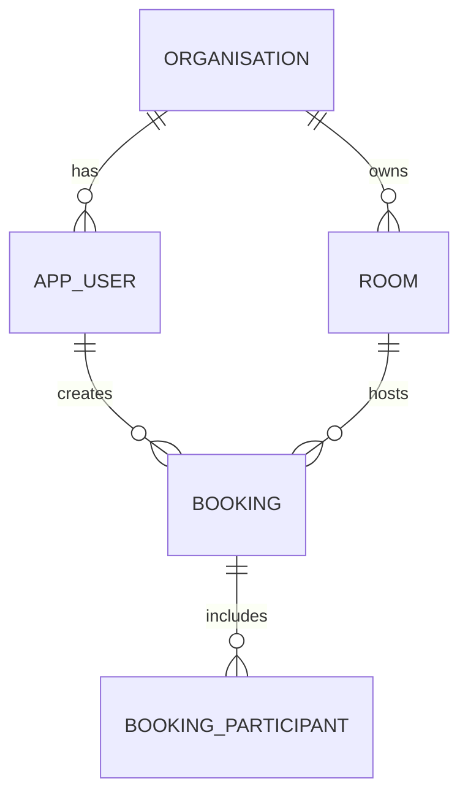

# Day 250 🏗️

**P-250** · Domain modelling and the ER diagram

**Time:** 3 hrs · **Mode:** BUILD

> **⭐ The schema is the decision you will regret most if you get it wrong**, because changing a
> column on a table with data requires Day 166's five-deploy expand/contract, and changing a
> *relationship* can require rewriting every query in the application.
>
> Day 188 gave you the design checklist. **Today you run it against your own domain**, and the output
> is a diagram plus the first migration — not yet applied.

---

# Part 1 — ⭐ Find the entities and the aggregates

**⭐ Start from the nouns in your requirements, then apply one test that most people skip:**

> **⭐ Which of these have an independent lifecycle, and which only exist as part of another?**

| Independent | ⭐ Part of something else |
|---|---|
| `Booking`, `Room`, `User`, `Organisation` | ⭐ `BookingLineItem`, `Address`, `Money` |

**⭐ The second column becomes embeddables or cascading children** (Day 158, Day 159); the first
column becomes tables with their own identity and their own repository.

**⭐ Then draw the aggregate boundaries** — the groups that must change together atomically:

```
⭐ Aggregate: Booking
   Booking (root) ── BookingParticipant[]
                  └─ status transitions

⭐ Aggregate: Room
   Room (root) ── Availability rules

⭐ Bookings reference Room by ID. They are SEPARATE aggregates.
```

**⭐ Why this matters more than it looks:** the aggregate boundary is your transaction boundary
(Day 164). Two things in one aggregate change in one transaction; two things in different aggregates
should not require a transaction spanning both. **If you find yourself needing a transaction across
three aggregates for a routine operation, your boundaries are wrong** — and that is the same
diagnosis Day 213 gave for MongoDB.

---

# Part 2 — ⭐ The ER diagram, and the decisions inside it

**⭐ Draw it. In Mermaid, committed to the repository, not on a whiteboard photo.**



**⭐ For every relationship, decide and write down four things** (Day 159):

| Decision | Question |
|---|---|
| ⭐ **Cardinality** | one-to-many, many-to-many, one-to-one |
| ⭐ **Owning side** | ⭐ which table holds the foreign key |
| ⭐ **On delete** | ⭐ `restrict` (default), `cascade` (composition only), `set null` |
| ⭐ **Do you navigate it in code?** | ⭐ if not, **do not map the collection at all** |

**⭐ The fourth is the one people get wrong.** Day 159: a `@OneToMany` collection on `Room` for its
bookings is an unbounded collection — one `getBookings()` from an OOM. **Map the `@ManyToOne` only,
and query bookings with a `Pageable`.**

## ⭐ Run Day 188's checklist against your model, now

| # | Check |
|---|---|
| 1 | Every table in 3NF, deviations deliberate and documented |
| ⭐ 2 | ⭐ **Every event copies the values it depends on** (price paid ≠ current price) |
| 3 | A foreign key per relationship, with a **deliberate** `on delete` |
| ⭐ 4 | ⭐ **A check constraint per state-machine invariant** (Day 249's diagram) |
| 5 | `not null` unless absence is meaningful |
| ⭐ 6 | ⭐ **`timestamptz` for instants, `numeric` for money** |
| ⭐ 7 | ⭐ **An index per query pattern, leading column correct** — Part 3 |
| 8 | Soft deletes? Then partial unique indexes and a view |
| ⭐ 9 | ⭐ **`tenant_id` first in every composite index; RLS planned** |
| 10 | Nothing unbounded — growing arrays, unpartitioned event tables |
| ⭐ 11 | ⭐ **Can this be migrated with expand/contract?** |
| 12 | Would the write path and the report path prefer different shapes? |

**⭐ Item 11 is the cheapest today and the most expensive later.** Look at every column and ask: if
this needs to be split, widened or renamed in a year, can I do it in five deploys without downtime?
If a column is obviously going to need splitting, split it now.

## ⭐ The identity decision

```
⭐ id         bigint generated always as identity   — internal, sequence-based, batchable
⭐ public_id  uuid not null default gen_random_uuid() — what appears in URLs and JSON
```

**⭐ Day 158's two-id pattern, and the reason is Day 119's IDOR**: a sequential id in a URL lets
anyone enumerate your data and tells a competitor your volume from two requests. **This is one of the
easiest "why did you do that?" wins in the whole project**, because most candidates have never
thought about it.

⭐ **Alternative: a UUIDv7 primary key** if your stack supports it — time-ordered so it indexes well,
unguessable so it is safe in a URL. Either is defensible; **having chosen deliberately is the point.**

---

# Part 3 — ⭐ Design the indexes now, from the queries

> **⭐ Do not defer indexing. Write the query list today and design an index for each.**

```markdown
| Query                                          | ⭐ Index                             |
|------------------------------------------------|--------------------------------------|
| Bookings for a user, newest first, paginated   | ⭐ (user_id, starts_at DESC)         |
| Overlap check for a room                        | ⭐ EXCLUDE USING gist (room_id, during)|
| Pending bookings to expire (the job)            | ⭐ (expires_at) WHERE status='PENDING'|
| Room list for an org                            | (org_id, name)                       |
| Booking by public_id                            | UNIQUE (public_id)                   |
```

**⭐ Three of those rows are decisions from earlier days, and you should be able to name them:**

- ⭐ **Row 1** — Day 190's rule 3: the sort column last, so `LIMIT 20` reads twenty index entries
  instead of sorting every match.
- ⭐ **Row 2** — Day 187's exclusion constraint: it *is* the overlap check, and it makes
  double-booking structurally impossible rather than merely detected.
- ⭐ **Row 3** — Day 190's partial index: the expiry job touches a tiny index no matter how large the
  history grows. **Without it, the job gets slower every day forever.**

**⭐ And every foreign key you filter or join on gets an index** (Day 189) — PostgreSQL does not
create them, and their absence is the single most common real-world omission.

---

# Part 4 — ⭐ Write the first migration (do not run it yet)

```
src/main/resources/db/migration/
└── V20260814100000__initial_schema.sql        ⭐ timestamp version (Day 166)
```

**⭐ Write it as plain SQL by hand.** Not generated from entities — the schema is the source of truth
and the entities will be written to match it (Day 157's `ddl-auto: validate`).

**⭐ It must contain:**

| | |
|---|---|
| ⭐ Tables with **`not null`** where absence is meaningless | |
| ⭐ **Check constraints for every state invariant** | Day 249's machine |
| ⭐ **The exclusion constraint** for your hard problem | Day 187 |
| Foreign keys with deliberate `on delete` | |
| ⭐ **Every index from Part 3** | |
| ⭐ `version bigint not null default 0` for optimistic locking | Day 165 |
| Audit columns — `created_at`, `updated_at`, `created_by` | Day 165 |

**⭐ Then review it against Day 166's operational rules** even though it is the first migration:

- ⭐ `set lock_timeout = '3s';` at the top — **make it a habit from migration one** (Day 196).
- ⭐ Column order widest-first on tables expected to be large (Day 187's alignment padding).
- ⭐ Ask of each table: will this need partitioning? If it is an events or audit table with
  retention, **partition it now** (Day 200) — retrofitting is expand/contract with no help.

---

## ⭐ Traps

| Trap | Consequence |
|---|---|
| ⭐ Generating the schema from entities | ⭐ `ddl-auto: update` by another name; unreviewable |
| ⭐ Mapping every relationship bidirectionally | unbounded collections, Day 159's bugs |
| ⭐ Deferring index design | ⭐ you discover the missing index in production |
| No exclusion constraint where overlaps matter | your hard problem is unsolved at the schema level |
| Sequential ids in URLs | Day 119 enumeration |
| `timestamp` instead of `timestamptz` | Day 187 |
| `double` for money | Day 106 |
| ⭐ No `version` column | ⭐ retrofitting optimistic locking later is a migration plus code everywhere |
| No check constraints for states | Day 187's `SHIPPED` with no ship date |
| Not asking the expand/contract question | the expensive discovery |
| An unpartitioned events table with retention | Day 194's bulk-delete bloat |

## ⭐ Self-review

- [ ] Aggregate boundaries drawn, and **no routine operation spans three of them**
- [ ] Every relationship has cardinality, owning side, `on delete`, and a navigate-or-not decision
- [ ] ⭐ **All twelve checklist items answered**, with deviations documented
- [ ] ⭐ Every state-machine invariant has a **check constraint**
- [ ] ⭐ The hard problem is enforced **in the schema**, not only in code
- [ ] Every query in the list has an index, with the leading column justified
- [ ] ⭐ Two-id pattern (or UUIDv7) chosen deliberately
- [ ] `version` and audit columns present
- [ ] The ER diagram is committed as Mermaid
- [ ] ⭐ **ADR-0002 written**: the schema decisions and what you gave up

## 🎤 Defence questions

1. **⭐ Why is your primary key not what appears in the URL?**
2. **Why did you not map bookings as a collection on `Room`?**
3. **⭐ Which invariants are enforced by the database rather than the application, and why those?**
4. **⭐ Show me an index and explain why the columns are in that order.**
5. **⭐ Which column would be hardest to change in a year, and how would you do it?**
6. **Where did you deviate from third normal form, and why?**

## ✅ Done when

- The ER diagram and the migration file are committed
- Every constraint and index has a reason you can state
- ADR-0002 exists with an honest consequences section
- ⭐ **The migration has not been run — Day 253 runs it**

---

**Previous:** [Day 249](Day-249.md) · **Next:** [Day 251](Day-251.md) — the API contract
